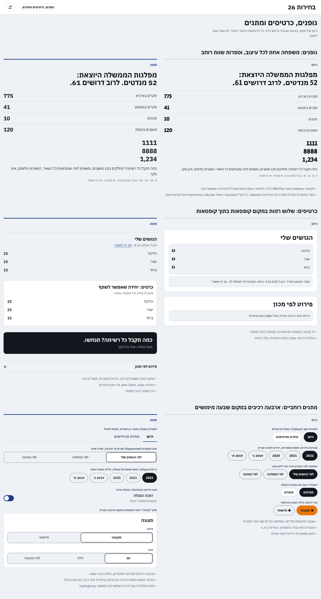
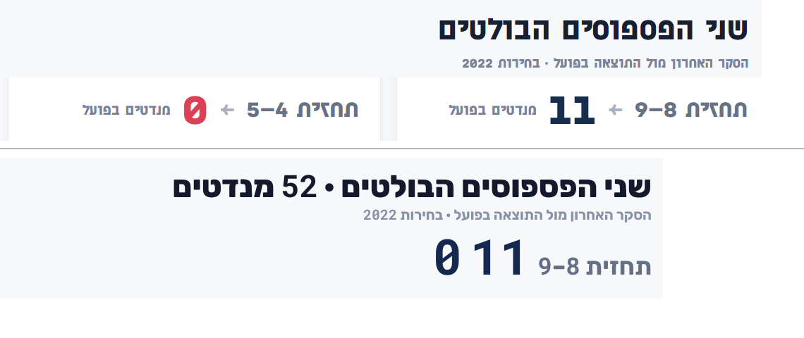
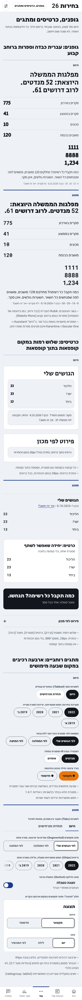

# גופנים, כרטיסים ומתגים רוחביים בכל האתר: תכנון

> נכתב ב-9.10.2026, כהמשך ל[הצעת העיצוב מחדש](עיצוב-מחדש-מחקר-והצעה.md), לפי בקשת הבעלים: *"תכנן גם שינוי עיצוב גופנים וכרטיסים ומתגים רוחביים בכל האתר."*
>
> **עודכן לפי דוגמה של הבעלים:** בתמונת "שני הפספוסים הבולטים" של המומחה הגופן כבד ורחב, והספרות בגופן ברוחב קבוע ("11" עם רגליים). לכן ההצעה לגופנים **דומה לדוגמה**: Rubik לעברית וספרות ב-Roboto Mono (סעיף 2.1).
>
> **סטטוס (9.10.2026): הבעלים אישר גופנים (#112, מוזג), שלוש רמות כרטיס (#113, מוזג) ומתג מקטעים וצ׳יפים (PR נפרד). לא משתנים, לפי הבעלים: לשוניות (`Tabbed`), מתג הדלקה וחלון "תצוגה". אירוח עצמי של הגופנים (החלטה 18) לא אושר. לא שונה שום חישוב.** הטקסט שלמטה הוא התכנון המקורי; **הסטייה היחידה בפועל:** ארבעת נושאי הפנייה (תמיכה וחלון ההערה) הם `Segmented` ולא `Chips`, לפי הכלל "2 עד 4 אפשרויות ⇐ מתג מקטעים" ובלי גלילה שמסתירה אפשרות.
>
> *(הסטטוס המקורי:)* **תכנון להחלטה. לא שונה קוד האתר ולא שום חישוב.** ההדגמות הן דפי HTML סטטיים שנבנו מנתוני האתר ([`ui-kit.html`](redesign-assets/ui-kit.html), ועוד הדפים באותה תיקייה, שכולם כבר בגופנים המוצעים).

---

## 0. בקצרה

**שלוש תקלות מדודות, שלוש תשובות:**

| נושא | מה מצאתי | מה מוצע |
|---|---|---|
| **גופנים** | הקוד מסמן ספרות כ"שוות רוחב" ב-**125 מקומות**, אבל שלושה מארבעת הגופנים של האתר (Assistant, Secular One, Karantina) **אינם תומכים בכך**. בטורי מספרים הספרות אינן מיושרות. Karantina צר כל כך שמשפט באורך שורה תופס 56% מהרוחב של גופן רגיל. | **סגנון הדוגמה של המומחה, בשני העיצובים:** עברית ב-**Rubik** (כבד ורחב) וספרות ב-**Roboto Mono** (ברוחב קבוע, "1" עם רגליים). הספרות מיושרות באמת בכל טור. |
| **כרטיסים** | כל קבוצה בקופסה ממוסגרת, כותרת כל כרטיס 30px בגופן הכותרות, וב-7 מקומות כרטיס כתוב ידנית בריווח אחר. כרטיס בתוך כרטיס. | **שלוש רמות:** משטח (קו דק), כרטיס (מסגרת), פאנל (כהה). כותרת 20px. בלי קופסה בתוך קופסה. |
| **מתגים רוחביים** | **שבעה מימושים נפרדים** של בחירה אחת מכמה, בשלושה גבהים (36, 40, 44) ושני עוביי מסגרת. "מערכת בחירות" (חמש אפשרויות) יורדת לשתי שורות בטלפון. ארבעה בקרים בראש העמוד. | **ארבעה רכיבים לארבעה תפקידים:** לשוניות, מתג מקטעים, צ׳יפים, מתג הדלקה. כולם 44px, שורה אחת. |

**מה זה עולה:** כלום. הגופנים המוצעים **קלים יותר**: כ-48KB בשני העיצובים, לעומת 55KB במקצועי ו-82KB בחדשותי (ראו סעיף 2.1).

**מה צריך ממך:** ארבע החלטות קצרות ב[סעיף 4](#4-החלטות-שדרושות-מהבעלים).

---

## 1. המצב היום, במספרים

### 1.1 גופנים
| | מקצועי | חדשותי |
|---|---|---|
| כותרות ומספרים גדולים | Secular One (משקל יחיד) | Karantina (צר מאוד) |
| גוף הטקסט | Assistant | Heebo |
| קבצי גופן שנטענו (מדד, טלפון) | 4 קבצים, כ-55KB | 6 קבצים, כ-82KB |

מדדתי בדפדפן, לכל גופן, את היחס בין הספרה הרחבה לצרה (1.00 = כל הספרות שוות) ואם `tabular-nums` עובד:

| גופן | יחס ספרות | `tabular-nums` | הערה |
|---|---|---|---|
| Heebo | 1.00 | עובד | |
| IBM Plex Sans Hebrew | 1.00 | עובד | נבדק |
| Noto Sans Hebrew | 1.00 | עובד | |
| Frank Ruhl Libre | 1.22 | עובד | נבדק (סריף) |
| **Rubik** | 1.37 | עובד | **מוצע: עברית.** הספרות שלו מוחלפות ב-Roboto Mono |
| **Roboto Mono** (תת-קבוצה של ספרות) | 1.00 | ברוחב קבוע | **מוצע: ספרות** |
| Assistant | 1.09 | **לא עובד** | היום (מקצועי, גוף) |
| Secular One | 1.34 | **לא עובד** | היום (מקצועי, כותרות ומספרים) |
| Karantina | 1.58 | **לא עובד** | היום (חדשותי, כותרות ומספרים) |
| Suez One, Alef | 1.67, 1.46 | לא עובד | נבדקו |

- **125 מקומות** בקוד משתמשים במחלקה `tabular`, ו-11 ב-`font-num`. בשלושה מהגופנים הנוכחיים זה לא משפיע.
- **Karantina:** משפט עברי באורך אחד נמדד ב-306 פיקסלים, לעומת 497 עד 595 בשאר הגופנים. בגודל 12 עד 14px הוא קשה לקריאה.
- **JetBrains Mono** מוגדר ב-`index.html` ואינו בשימוש בשום מקום בקוד.
- המדידות והתמונה של 13 גופנים שנבדקו: [`fonts-candidates.png`](redesign-assets/img/fonts-candidates.png).

### 1.2 כרטיסים
- `Card` ו-`Fold` ב-`ui.tsx`: מסגרת 1px, ריווח 16/20, וכותרת **30px בגופן הכותרות** (44 מקומות בקוד משתמשים בגופן הכותרות).
- **7 כרטיסים כתובים ידנית** (מסגרת ועיגול) בריווחים p-3, p-5 sm:p-6 ועוד. `PersonalBlocs` מוסיף כרטיסים בתוך כרטיסים.
- בטלפון, במסכים "המצב היום", "תרחישים", "בחירות קודמות" ו"מה השתנה": **3 עד 9 בלוקים ממוסגרים ברמה העליונה** בכל מסך.

### 1.3 מתגים רוחביים
| מקום | מימוש | גובה | מסגרת הלא-נבחר |
|---|---|---|---|
| לשוניות מסך (`Tabbed`) | כפתורים עגולים, מילוי כהה לנבחר | 44 | `paper-line` (ניגודיות 1.4:1) |
| מערכת בחירות (`Results`) | כפתורים עגולים, **חמישה, יורדים לשתי שורות** | 44 | `ink-faint` |
| השוואה לפי (`Changes`) | כפתורים עגולים | 44 | `ink-faint` |
| יחידה (`History`) | כפתורים עגולים, מסגרת 2px | 44 | `paper-line` |
| מנדטים/אחוזים (`Dashboard`) | כפתורים עגולים | **40**, מסגרת 2px | `paper-line` |
| נושא פנייה (`Feedback`) | צ׳יפים (`aria-pressed`) | **40** | `ink-faint` |
| בורר עיצוב (`StylePicker`) | כפתורים עם נקודת צבע, מילוי בצהוב/כתום | 44 (במחשב **36**) | |

בנוסף: ארבעה מתגי הדלקה כל אחד בצורה אחרת (`ChartWithTable`, נעילת מושב, הצגת סיסמה, וכפתור `ModePicker` שמחליף בין שלושה מצבים בלי לראות אותם). בבדיקה בדפדפן ברוחב 390: "מערכת בחירות" בשתי שורות בשני העיצובים.

---

## 2. ההצעה

### 2.1 גופנים

**למה Rubik ו-Roboto Mono:** בדקתי כמה גופנים מול הדוגמה. הדמיון הקרוב ביותר בעברית (כבד, רחב, פינות מרובעות) הוא Rubik 700 עד 800. הספרות בדוגמה הן בגופן ברוחב קבוע, ולכן הוספתי Roboto Mono רק לספרות: "1" עם רגליים ואפס חתוך, וכל הספרות ברוחב זהה. (לא הצלחתי לזהות בוודאות את הגופן המדויק בתמונה, אז זו התאמה בקירוב.)

| תפקיד | גופן |
|---|---|
| עברית: כותרת ראשית, כותרות, שמות, גוף | **Rubik** 800 לכותרות, 700 לשמות, 500 ו-400 לגוף |
| ספרות (מנדטים, אחוזים, תאריכים, צירים, גם בתוך משפט) | **Roboto Mono** 400 עד 700, תת-קבוצה של 10 ספרות בלבד |

**איך זה עובד:** הגופן Roboto Mono נטען עם הספרות בלבד (`&text=0123456789` ב-Google Fonts), ורשימת הגופנים היא `"Roboto Mono", "Rubik"`. כל ספרה מגיעה מ-Roboto Mono, וכל השאר (אותיות, רווחים, פיסוק) מ-Rubik. אין צורך לסמן ספרות בקוד, והן מיושרות גם בתוך משפט.

כללים:
- **שני העיצובים באותה משפחה.** ההבדל ביניהם בצבע, ברדיוס ובמבנה הכותרת, לא בגופן. מוסרים: Assistant, Secular One, Karantina, Heebo ו-JetBrains Mono (שמוגדר ב-`index.html` ואינו בשימוש).
- סולם הכתב נשאר 12 · 14 · 16 · 20 · 24 · display (ראו `עיצוב-מחדש-מחקר-והצעה.md`, 8.1). הכותרת הראשית ב-Rubik 800 בגודל 28px בטלפון ו-45px במחשב (Rubik רחב יותר מהגופנים של היום).
- הדגשה במשקל בלבד, בלי נטוי (נטוי בעברית פחות קריא) ובלי קו תחתון.
- `text-wrap: balance` לכותרות, ללא ריווח אותיות.
- שני הגופנים ברישיון SIL OFL (חופשי לשימוש ולאירוח עצמי).

**מה זה עולה (נמדד בדפדפן, טלפון):**

| | היום | מוצע | הפרש |
|---|---|---|---|
| מקצועי | 4 קבצים, 55KB | 3 קבצים, 48KB | **−8KB** |
| חדשותי | 6 קבצים, 82KB | 3 קבצים, 48KB | **−34KB** |

המוצע קל יותר כי Rubik נטען כקובץ אחד בעברית וקובץ אחד בלטינית, ו-Roboto Mono רק לעשר ספרות (כ-4KB). אפשר לחסוך עוד באירוח עצמי (בלי בקשה לצד שלישי ובלי שבירת פריסה בזמן הטעינה): **החלטה 18, אופציונלית.**

**שלוש חלופות להחלטה:**

| | מה משתנה | יתרון | חיסרון |
|---|---|---|---|
| **א. מוצע (דומה לדוגמה)** | Rubik לעברית, Roboto Mono לספרות, בשני העיצובים | נראה כמו הדוגמה של המומחה; ספרות מיושרות בכל מקום; קל יותר מהיום | שינוי ויזואלי גדול; הכותרות רחבות יותר (נבדק ברוחב 360) |
| **ב. מינימלי** | Heebo לגוף ולכל המספרים; הכותרת הראשית נשארת Secular One / Karantina (מעל 28px) | הזהות הנוכחית נשמרת; ספרות נכונות | הכותרת עדיין בגופן בלי ספרות שוות רוחב |
| **ג. להשאיר** | בלי שינוי | אפס סיכון | 125 מקומות עם יישור שלא עובד |

הצעה קודמת שנבדקה והוסרה: IBM Plex Sans Hebrew (מקצועי) ו-Frank Ruhl Libre בכותרות (חדשותי). טובה בקריאות, אבל רחוקה מהדוגמה שהבעלים ביקש, וכבדה ב-20KB.

### 2.2 כרטיסים: שלוש רמות

| רמה | איך נראית | מתי |
|---|---|---|
| **משטח** (ברירת המחדל) | בלי קופסה: קו דק למעלה ורווח. כותרת 20px, משקל 800, שורת מקור אחת | רוב התוכן |
| **כרטיס** | מסגרת 1px, רדיוס העיצוב, ריווח 16 (טלפון) / 20 (מחשב) | יחידה שאפשר לשתף, להוריד או לפעול עליה (כרטיס גושים אישי, תמונת שיתוף) |
| **פאנל** | רקע כהה (`band`) | פעולה ראשית אחת בכל מסך ("הכנסת שלי") |
| **שורת קיפול** (`Fold`) | קווים עליון ותחתון, כותרת 16px, `+` | פירוט משני |

כללים: **אין קופסה בתוך קופסה**; כותרת בכל רמה 20px בגופן הגוף (לא 30px בגופן הכותרות); רווח של 32px בין משטחים; בלי צל; רדיוס אחד לכל עיצוב (12px מקצועי, 10px חדשותי, כמו היום).

**בקוד:** מעדכנים שני רכיבים (`Card`, `Fold` ב-`ui.tsx`), מוסיפים `Surface` ו-`Panel`, ומחליפים את 7 הכרטיסים הכתובים ידנית ברכיבים. `PersonalBlocs` עובר למשטח עם שורת מקור אחת.

### 2.3 מתגים רוחביים: ארבעה רכיבים

| תפקיד | רכיב | עיצוב | איפה היום |
|---|---|---|---|
| **מעבר בין מסכים** (2 עד 4) | **לשוניות (Tabs)** | טקסט עם קו תחתון עבה בצבע ההדגשה, מתחת לסרגל, גלילה אם לא נכנס | `Tabbed` (היום, תחזית ותרחישים; ארכיון, מגמות) |
| **בחירה אחת מ-2 עד 4**, אותו מסך | **מתג מקטעים (Segmented)** | מסלול אחד, מקטעים שווים בשורה אחת, הנבחר כמסגרת כהה ורקע כרטיס | `Changes`, `Dashboard`, `History`, שיתוף, סוג פנייה בתמיכה ובהערה (אושר: בורר העיצוב והמצב נשארים כמו היום) |
| **בחירה אחת מ-5 ומעלה**, או סינון מרובה | **צ׳יפים (Chips)** | כפתורים עגולים בשורה אחת, גלילה אופקית עם טשטוש בקצה | `Results` (מערכת בחירות) |
| **הפעלה וכיבוי** | **מתג הדלקה (Switch)** | טקסט וכפתור, `role="switch"`, מצב כתוב | הצגה כטבלה, הצגת סיסמה |

פרטים:
- **גובה 44px** בכל הרכיבים (היום 36, 40 ו-44), מסגרת אחת (1.5px). הנבחר מסומן **במסגרת כהה או בקו תחתון**, לא בצבע בלבד (ניגודיות מעל 3:1, WCAG 1.4.11). מסגרת הלא-נבחר ב-`ink` ב-35%.
- **נגישות:** `tablist` ו-`radiogroup` עם חצים במקלדת (roving tabindex), מיקוד נראה, `aria-checked` ו-`aria-selected`. היום אין בקוד של הלשוניות והבוררים טיפול בחצים (נבדק).
- **RTL:** האפשרות הראשונה מימין; ההדגשה והגלילה בכיוון הקריאה.
- **"תצוגה":** כפתור אחד בראש העמוד פותח חלון עם שני מתגי מקטעים (עיצוב: מקצועי/חדשותי; מצב: יום/לילה/לפי המכשיר). **מחליף** את `StylePicker` ואת `ModePicker` (שמחליף בין שלושה מצבים בלי להציג אותם).
- **חמש אפשרויות ומעלה לא יורדות לשורה שנייה:** צ׳יפים בגלילה, או `select` של המכשיר.

---

## 3. תוכנית הטמעה בכל האתר

**מה נוגעים בו:** `src/index.css` (משתני הגופן והמשקל), `index.html` (טעינת הגופנים), `tailwind.config.js` (`font-num`), `ui.tsx` (`Card`, `Fold`), `Tabbed.tsx`, ושמונת המקומות שבסעיף 1.3. **לא נוגעים:** בחישובים, בנתונים, בצינור ובמנוע.

| שלב | מה | יעד |
|---|---|---|
| **1** | טוקנים וגופנים (משתני CSS, טעינה); רכיבים חדשים `Segmented`, `Tabs`, `Chips`, `Switch`, `Surface`, `Panel`; דף ערכת רכיבים פנימי להשוואה | עד 14.10, מאחורי דגל תצוגה מקדימה |
| **2** | החלפת השימושים מסך אחר מסך (לשוניות, שבעת הבוררים, `Card`, `Fold`, `PersonalBlocs`, חלון "תצוגה") | עד 20.10 |
| **3** | בדיקות מלאות והפעלה | 21 עד 24.10 |

**בדיקות לפני כל PR:** הבדיקות המקומיות של `CLAUDE.md`, ובנוסף: שני העיצובים × בהיר/חשוך × רוחבים 360, 390, 768, 820, 1024, 1280, בלי גלישה אופקית; יישור ספרות בטורים (`tabular-nums` באמת פועל); ניגודיות בצילום; ניווט חצים ו-Tab במקלדת; מיקוד נראה; יעד נגיעה 44px; השוואת צילומים לפני ואחרי.

**סיכונים:** שינוי רוחבי סמוך לבחירות ⇐ דגל, שלבים קטנים וחזרה מיידית. הכותרות ב-Rubik רחבות יותר מהגופנים של היום ועלולות לשבור שורות: נבדק בכל מסך ברוחב 360. חלופה ב שומרת על הזהות הנוכחית.

---

## 4. החלטות שדרושות מהבעלים

| # | החלטה | המלצה |
|---|---|---|
| 15 | **גופנים:** חלופה א (דומה לדוגמה: Rubik וספרות Roboto Mono), ב (מינימלי) או ג (להשאיר) | **א** |
| 16 | **כרטיסים:** שלוש רמות (משטח, כרטיס, פאנל) וכותרת 20px | כן |
| 17 | **מתגים:** ארבעת הרכיבים, וחלון "תצוגה" במקום שני הבוררים | כן |
| 18 | **אירוח עצמי של הגופנים** (עברית וספרות בלבד): פחות משקל, בלי צד שלישי | כן, אחרי שלב 2 (אופציונלי) |

---

## 5. הסתייגויות
- ההדגמות הן **דפי HTML סטטיים**, לא קוד האתר, ולא נבדקו עם קורא מסך.
- בדקתי **כ-20 גופנים** בלבד (13 בטבלה הראשונה ועוד כ-10 בהשוואה לדוגמה), ובחרתי לפי ספרות, קריאות, גודל קובץ ודמיון לדוגמה. **לא זיהיתי בוודאות את הגופן המדויק שבתמונה של המומחה** (נראה כגופן ברוחב קבוע, כנראה גופן מערכת). הבחירה הסופית היא עניין של טעם.
- משקלי הקבצים נמדדו בדפדפן בסביבת הבדיקה, ויכולים להשתנות מעט לפי מה שהדפדפן מוריד.
- ניגודיות מסגרת הלא-נבחר (1.4:1) נחשבה מהטוקנים, לא נבדקה בכלי נגישות חיצוני.
- ההצעה הזו אינה משנה שום חישוב, טווח, ממוצע או חציון.
