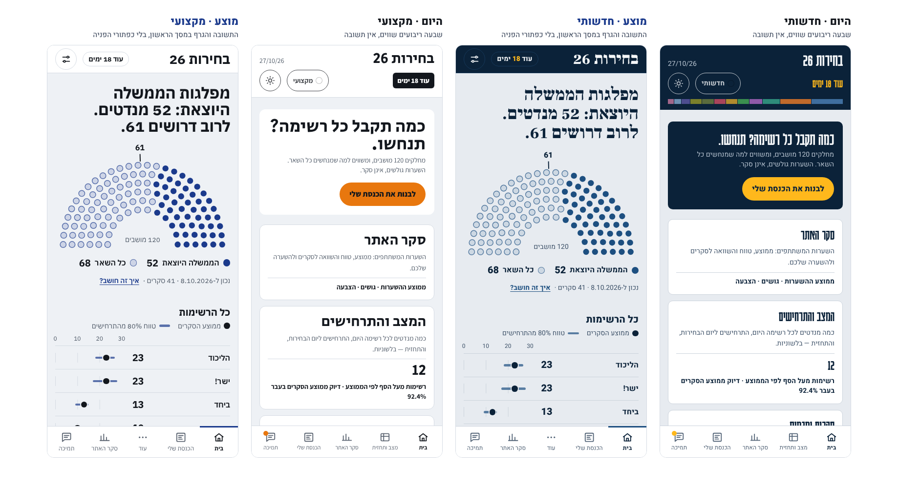
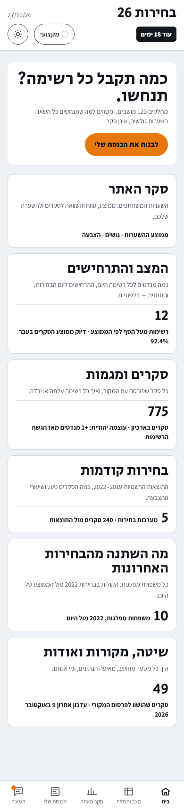
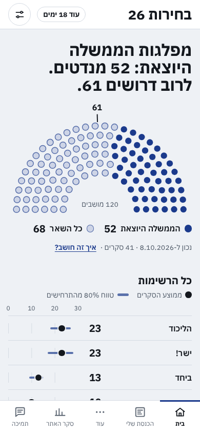
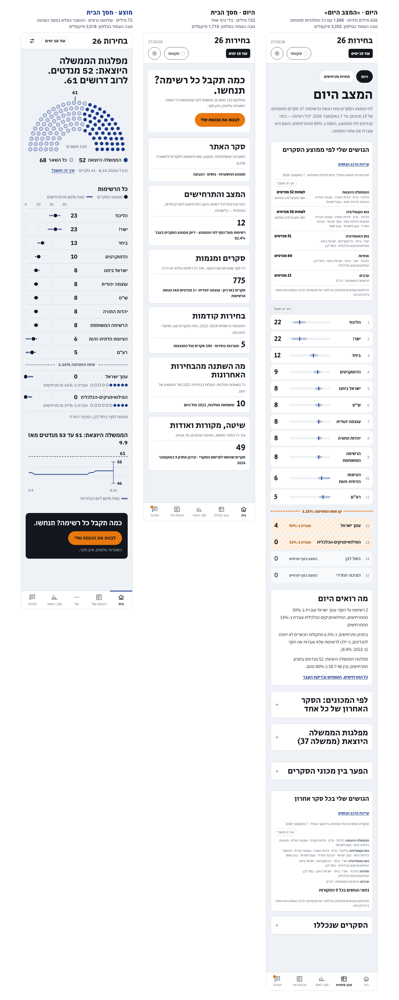
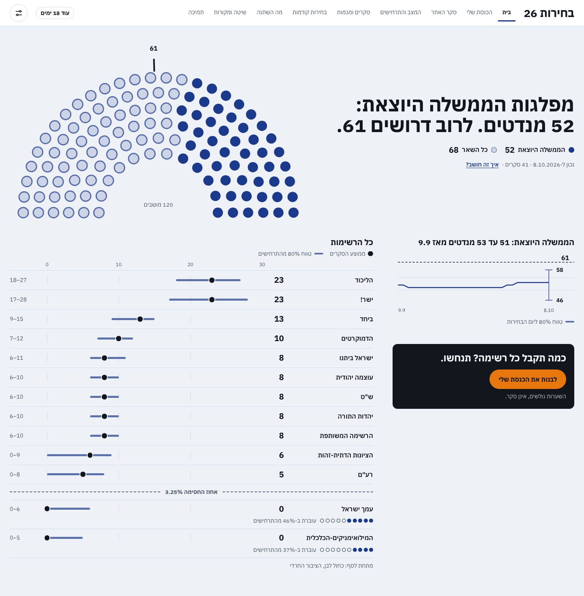
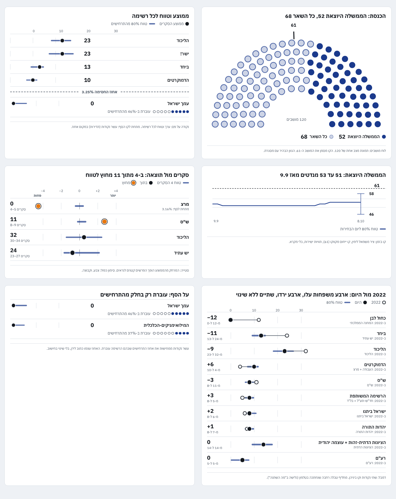
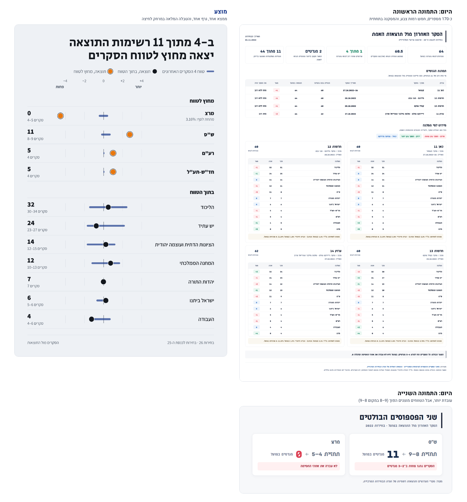

# עיצוב מחדש מקצה לקצה: מחקר והצעה (גרסה 2)

> נכתב ב-9.10.2026, בעקבות ביקורת של מומחה לבניית אתרים: *"הבעיה היא הרמה הגרפית. בגדול לנקות ולנקות. יותר מדי בלאגן בעיניים."* המומחה צירף שתי תמונות גרפיקה ([תמונה 1](redesign-assets/img/expert-graphic-1.png), [תמונה 2](redesign-assets/img/expert-graphic-2.png)).
>
> **גרסה 2** מוסיפה את ההנחיה של הבעלים: *תמצות הסברים, צמצום כפילויות מידע, הסברים מלאים רק במסך "שיטה, מקורות ואודות", והאתר מתמקד בעיקר בגרפים ותרשימים.* היא מחליפה את גרסה 1 (שמוזגה כ-PR #104), והשתנו בה בעיקר הסעיפים 2.2, 4, 5, 6, 7 ו-12.
>
> **תכנון נוסף:** [גופנים, כרטיסים ומתגים רוחביים בכל האתר](עיצוב-גופנים-כרטיסים-מתגים.md) (מסמך נפרד, החלטות 15 עד 18). כל ההדגמות בתיקייה כבר מוצגות בגופנים המוצעים.
>
> **עודכן באותו יום לפי שלוש הנחיות נוספות של הבעלים:** (1) **אין שינוי בחישובי נתונים בלי אישור** (סעיף 4, "גבול ההצעה"); (2) **הבית בלי כפתורי הפניה**, חוץ מפאנל "הכנסת שלי"; (3) **סרגל הטלפון: בית · הכנסת שלי · עוד · סקר האתר · תמיכה**, כש"עוד" באמצע ופותחת חלון עם כל המסכים שאינם בסרגל, כולל "המצב והתרחישים" (סעיף 5.7). **(2) ו-(3) בוצעו באתר.**
>
> **עדכון מ-`main`:** בינתיים בוטלה ההקפאה (אישור משפטי של הבעלים, PR #108) והסקרים נקלטים אוטומטית (PR #107). לכן הוסרו מההצעה באנר ההקפאה ומצב ההקפאה, והמספרים והתמונות נבנו מחדש מנתוני 8.10.2026.
>
> **סטטוס: ההצעה הכללית ממתינה לאישור הבעלים, ושני דברים שהבעלים הורה עליהם במפורש כבר בוצעו באתר (באותו PR): מחיקת כפתורי ההפניה מהבית ולשונית "עוד" באמצע הסרגל בטלפון, במקום "סקר האתר" ("הכנסת שלי" נשארת). לא שונה שום חישוב, נתון או צינור.** לפי `CLAUDE.md`, שינוי מחוץ לתוכנית שאושרה ⇐ קודם שואלים. ההחלטות שצריך: [סעיף 12](#12-החלטות-שדרושות-מהבעלים).
>
> **איך לראות:** התמונות ב-`docs/redesign-assets/img/`, וההדגמות (HTML) ב-`docs/redesign-assets/`. הן נבנו **מהנתונים האמיתיים של האתר** (`model.json`, `history.json`, `results.json`).



---

## 0. בקצרה

**האבחנה.** הביקורת של המומחה נכונה, ויש לה שתי סיבות מבניות. הראשונה: **אין "תשובה" אחת שבולטת.** שבעה ריבועים שווים בבית, ובתמונות של המומחה כ-170 מספרים בלי ממצא מרכזי. השנייה, והיא החדשה בגרסה זו: **אותו דבר נאמר שוב ושוב, ובמילים.** "הגושים שלי" מופיע 12 פעמים ב-11 מסכים, 27 כפתורי "איך זה חושב?" מסבירים רק 10 דברים, וה"המצב היום" מכיל 626 מילים גלויות (1,888 כשהכול פתוח). כשכל גרף מוקף בטקסט, העין לא יודעת איפה להתחיל, וזה מה שמרגיש כ"בלגן". הקוד עצמו נקי (כלי הבדיקה האוטומטי מצא רק שלוש הערות קלות), כלומר זו בעיית **הרכב, כפילות והיררכיה**, לא איכות בנייה. אפשר לתקן בלי לכתוב הכול מחדש.

**ההצעה: "תקציב טקסט" קשיח.**
1. **הגרף הוא התוכן.** כל מסך נפתח בגרף אחד ובמשפט ממצא אחד. מסך הבית הוא התשובה (כנסת של 120 מושבים, דירוג כל הרשימות, מגמת הממשלה היוצאת), לא תפריט: **אין בו כפתורי הפניה, חוץ מפאנל "הכנסת שלי"**. לשאר המסכים מגיעים מהניווט (במחשב) ומהסרגל התחתון עם לשונית "עוד" (בטלפון).
2. **כל עובדה פעם אחת במסך.** רכיב אחד לכל עובדה (טווח, גוש, הסף), בלי חזרות. שורה אחת לכל מסך: "נכון ל-... · איך זה חושב?".
3. **ההסבר המלא נמצא רק ב"שיטה, מקורות ואודות"**, שהופך ל"מילון המספרים": ערך לכל מספר שהאתר מחשב. בגרף עצמו נשארים תאריך וקישור לערך.
4. **מערכת עיצוב קטנה:** חמישה גדלי כתב וכותרת אחת גדולה בכל מסך (היום 9 עד 12), אות הדגשה אחד לכל משמעות, בלי אדום וירוק.
5. **שני העיצובים ("מקצועי", "חדשותי") נשארים כגוונים בלבד:** אותו מבנה, ההבדל בצבע, גופן ורדיוס.
6. **הטמעה בשלבים, עם דגל תצוגה מקדימה,** ולפני יום הבחירות (27.10).
7. **עיצוב בלבד: אין שינוי בחישובי נתונים** (טווח, ממוצע, תרחישים, מנוע המנדטים) בלי אישור שלך.

**מה מצאתי בדרך (שגיאות אמיתיות, לא רק טעם):**
- טווחי ספרות ותאריכים מוצגים **בסדר מבלבל** (50 טווחים ב-10 מסכים, כולם "ימין לשמאל"). [סעיף 2.4](#24-שגיאות-ופגמים-אמיתיים)
- גלישה אופקית בטלפון ב"מה השתנה" (409 פיקסלים במסך של 390).
- בגרסה הראשונה של ההדגמה פסי הטווח והמושבים הבהירים נכשלו בבדיקת ניגודיות לגרפיקה (1.3 עד 1.9 במקום 3). **תיקנתי ובדקתי במספרים** (סעיף 8.4).

**מה צריך ממך:** 16 החלטות פתוחות ב[סעיף 12](#12-החלטות-שדרושות-מהבעלים), עם המלצה לכל אחת. הדחופה: תיקון הטעויות (שלב 0), PR קטן שאינו משנה את מראה האתר.

---

## 1. המצב היום במספרים

"בלגן" הוא תחושה, ולכן מדדתי אותה בדפדפן אמיתי ברוחב טלפון (390 פיקסלים).

**מבנה ועומס חזותי:**

| מסך | גובה העמוד | גדלי כתב | אלמנטים עם מסגרת | כפתורים |
|---|---|---|---|---|
| בית | 1,645 | 4 | 13 | 0 (7 קישורים) |
| המצב היום | 3,290 | **9** (חדשותי: **12**) | **47** (חדשותי: **60**) | 7 |
| סקרים ומגמות | **10,386** | 6 | **162** | **54** |
| בחירות קודמות | 3,795 | 8 | 47 | 12 |
| הכנסת שלי | 1,327 | 7 | 10 | 8 |
| שיטה ומקורות | 2,777 | 5 | 18 | 2 |

**נפח הסברים וחזרות** (מדידה ב-9.10.2026, טלפון ומחשב, עיצוב מקצועי):

| מסך | מילים (אקורדיונים פתוחים) | מהן פסקאות | כפתורי "איך זה חושב?" | מילים נוספות כשכולם פתוחים |
|---|---|---|---|---|
| בית | 152 | 125 | 0 | 0 |
| המצב היום | 1,643 | 840 | 5 | +245 |
| תחזית ותרחישים | 1,728 | 770 | 8 | +472 |
| סקרים | 6,445 | 2,733 | 1 | +56 |
| מגמות | 317 | 101 | 2 | +106 |
| בחירות קודמות: תוצאות | 874 | 643 | 4 | +152 |
| בחירות קודמות: דיוק | 2,465 | 623 | 6 | +310 |
| מה השתנה | 575 | 334 | 1 | +56 |
| הכנסת שלי | 123 | 65 | 0 | 0 |
| שיטה, מקורות ואודות | 2,101 | 2,041 | 0 | 0 |

- **27 כפתורי "איך זה חושב?"** (25 מופעי `Explained` בקוד) שמסבירים **10 ערכים בלבד** (`model` ×7, `accuracy` ×5, ואחריהם `voters`, `results`, `personal-blocs`, `current`, `agreements`, `trends`, `engine`, `changes`). יחד הם מוסיפים כ-1,400 מילים בכל האתר, מעבר לכ-2,100 המילים של מסך השיטה עצמו.
- ב"סקרים" 21 חזרות על מחרוזות ארוכות (למשל "שלמה פילבר + NEXT DATA · ערוץ 14" תשע פעמים).
- **מסך הבית בטלפון בלי לגלול:** 12 יעדי לחיצה גלויים ונתון מספרי אחד. **הפס העליון:** 107 פיקסלים מתוך 844 (13%), בחדשותי 132.
- **"המצב היום":** טקסט 12px מופיע 111 פעמים (126 בחדשותי). רשימת הרשימות, שהיא התשובה, מתחילה כ-988 פיקסלים מתחילת העמוד, **מתחת למסך הראשון** (844).
- **כלי בדיקת העיצוב האוטומטי** (`impeccable detect`): **שלוש הערות קלות בלבד** בכל הקוד. הבעיה בהרכב ולא בניקיון הקוד.



---

## 2. אבחון: מה בדיוק יוצר את הבלגן

### 2.1 הבית הוא תפריט, והתשובה רחוקה
שבעה ריבועים באותו גודל, כל אחד עם כותרת, משפט ונתון. זה בדיוק "כרטיסים שווים כמבנה העמוד", ברירת המחדל ש"רצפת האיכות" של סקיל `impeccable` פוסלת. הנתונים בריבועים אינם מאותו סוג ("12", "775", "5", "10", "49", ולריבוע אחד אין נתון) ואינם עונים על שאלת הקהל הראשי (צעירים בטלפון): **מי עולה, מי יורד, מי על הסף.**

### 2.2 כפילויות והסברים: מפת המידע
כל עובדה צריכה **בית אחד** במסך. היום:

| העובדה | איפה היא מופיעה היום | הבית האחד המוצע |
|---|---|---|
| **הגושים שלי** (סכום מנדטים לגוש) | `PersonalBlocs`: **12 מופעים ב-11 קבצים** (ב"המצב היום" פעמיים) | מופע **אחד** לכל מסך, בצורה הקומפקטית שכבר הוכרעה. ב"המצב היום": מעבר "לפי הממוצע / לפי כל סקר" במקום שני כרטיסים |
| **הממשלה היוצאת: כמה מנדטים** | ב"המצב היום" עד **ארבע פעמים** (משפט "מה רואים היום", קיפול "מפלגות הממשלה היוצאת", ושני מופעי הגושים) | כותרת הבית, פעם אחת. בעמודים אחרים: גוש ב"הגושים שלי" בלבד |
| **ממוצע וטווח לכל רשימה** | טבלת הרשימות (`ListsView`), גרף טווחים (`SeatRangeBars`) ובלשונית התרחישים שוב טווחים (`ScenarioRanges`) | **רכיב אחד** (`RangeRow`), בכל מקום שצריך |
| **מי על הסף** | בדירוג (שורות מפוספסות עם אחוז) ושוב במשפט "מה רואים היום" | שורה אחת בדירוג, ליד קו אחוז החסימה, עם האחוז הקיים ועשר נקודות |
| **מגמת הממוצע** | בלשונית התרחישים (`TrendChart`) ובמסך המגמות | גרף אחד לכל נתון, עם קישור מהמסך השני |
| **"נכון ל-…", מקור, סוג, הנחה** | בכל כרטיס, בנפרד (`Explained`: 25 מופעים) | שורה אחת למסך ("נכון ל-… · איך זה חושב?"), והפירוט בערך המילון |
| **הסבר השיטה** | פסקאות מתחת לגרפים, קיפולים, וגם במסך השיטה | **רק במסך "שיטה, מקורות ואודות"** |
| **הגדרת הקבוצה "ממשלה 37"** | משפט הגדרה בקיפול של "המצב היום" ושוב בלשונית התרחישים | ערך אחד במילון, וקישור |

בתמונה 1 של המומחה אותה כפילות: טבלת גושים של 7 עמודות, ואחריה ארבע טבלאות של 11 שורות על אותן 11 רשימות. המסקנה ("הפער הבולט", מרצ) בתחתית.

### 2.3 צורה, צבע, טיפוגרפיה וכלים
- **מכלים:** ב"המצב היום" כתשעה סוגים (כרטיס, שורה, שורה מפוספסת, שורה אפורה, גלולה, צ'יפ, קו מקווקו, אקורדיון, קישור), כרטיסים בתוך כרטיסים.
- **כתב:** 9 עד 12 גדלים בעמוד אחד; 12px הוא הגודל השכיח בנתונים. גופן הכותרות החדשותי (Karantina) צר מדי בגדלים קטנים ובספרות.
- **צבע:** אותו כתום נושא ארבע משמעויות (כפתור ראשי, בורר העיצוב, "על הסף", נקודת התראה). בעיצוב החדשותי **פס של 12 גוונים בלי מקרא** בראש כל עמוד: גם אם הצבעים ניטרליים במכוון, הוא נראה כצבעי מפלגות ומוסיף רעש, וזה סיכון לכלל הניטרליות.
- **בתמונות של המומחה:** אדום, ירוק וכחול על כל שורה, וכל פער מקודד פי שלושה (סימן, צבע ומקרא). **הצבע מסמן כיוון ולא דיוק** (בטבלת הגושים כל הפערים באדום, גם −2 וגם −4), ואדום מול ירוק לא קריא לעיוורי צבעים (כ-8% מהגברים).
- **כלים לפני התוכן** (טלפון): תאריך, צ'יפ ספירה, בורר עיצוב, כפתור יום/לילה. אלה העדפות שנוגעים בהן פעם אחת.

### 2.4 שגיאות ופגמים אמיתיים

1. **טווחים מוצגים בסדר מבלבל (נמדד).** מקף ארוך (–) בין שני מספרים בעברית הוא תו "ניטרלי" בסדר הדו-כיווני של הדפדפן, ולכן המספר הראשון נמצא **מימין**: "4–5" מצויר "5–4". סרקתי 10 מסכים: **50 מופעים הפוכים, אפס "משמאל לימין"**. למשל "27–18" ב"המצב היום" (חדשותי, מחשב), "30.9.2026–1.10.2026" ב-16 שורות סקר, "2022–2019" בבית, ובתמונות של המומחה "תחזית 9–8" ו"ב-3–2". **זה לא בהכרח באג, אבל זה בלבול:** הסוכן העצמאי שבדק את התמונות קרא "9–8" כירידה, והאתר עצמו אינו עקבי (`DESIGN.md` ו-`signed()` ב-`format.ts` מכתיבים סדר משמאל לימין למספרים, הטווחים לא). מקומות בקוד: `ListsView.tsx:19`, `format.ts:11`, `Scenarios.tsx:127,182`, `Accuracy.tsx:245`, `Changes.tsx:274-275`, `charts.tsx:34,250`, `Today.tsx:137`, `pages.ts:15` ועוד כ-30 (39 שורות עם "ספרה–ספרה"). **התיקון הפשוט:** מקף רגיל (-) במקום ארוך (–). בדקתי בדפדפן: "4-5" נשאר "4-5".
2. **גלישה אופקית בטלפון ב"מה השתנה"** (409 במסך של 390, 433 בחדשותי): הטבלה נחתכת ("לפחות" ל"לפחו"). `DESIGN.md` מבטיח "בלי גלישה אופקית".
3. **שתי ספירות לאחור בלי תווית** ב"הכנסת שלי": "17 ימים 20 שעות" (נעילת ההשערות) ו"עוד 18 ימים" (הבחירות).
4. **מקף עברי "־"** ב"ב־80%" (בתמונות של המומחה) מצטייר כקו עליון. באתר משתמשים במקף רגיל.
5. **ניטרליות:** בתמונה 1 "גוש נתניהו". האתר מגדיר "מפלגות הממשלה היוצאת" בהגדרה עובדתית (ממשלה 37).
6. **הלוחית הצפה ("לבנות את הכנסת שלי") במחשב** מכסה פינה של הטבלה ב"המצב היום" בגובה מסך 900.

### 2.5 מה עובד, ואסור לאבד
1. הצורה השטוחה והשקטה של העיצוב המקצועי.
2. **קו אחוז החסימה** והמשפט "עוברת ב-50% מהתרחישים": "שיעור תרחישים" ולא "סיכוי"/"הסתברות".
3. **לוח 120 המושבים ב"הכנסת שלי"**: הוויזואל החזק ביותר באתר, ועליו בנוי הבית החדש.
4. **עומק במרחק לחיצה** ("איך זה חושב?", מקור, טבלה חלופית): ההצעה **מחזקת** אותו, ראו סעיף 6.
5. כל כללי הברזל: ניטרליות, שקיפות, נגישות, 360 פיקסלים, יום/לילה.

---

## 3. המחקר: מה עושים אחרים, ומה למדתי

**איך עבדתי.** סקילי עיצוב (מתוך `shared-skills`): `impeccable` (ביקורת, "רצפת איכות", עומס קוגניטיבי), `dataviz` (צורת גרף וצבע לפי תפקיד), `ui-ux-pro-max`, `hebrew-rtl-best-practices`, `design-taste-frontend`, `frontend-design`. חיפושי רשת על מעקבי סקרים ובחירות, תרשימי פרלמנט ו"דמבל". ביקורת עצמאית של סוכן נפרד שקיבל רק צילומים ואת `PRODUCT.md` ו-`DESIGN.md`. מדידות בדפדפן אמיתי ובדיקת ניגודיות במספרים.

| נושא | מה למדתי | מקור |
|---|---|---|
| מעקבי סקרים | **טווח עם רמת ביטחון מוצהרת** (80% או 95%), וסף הרוב כקו ייחוס. כדאי רמה אחת, כתובה על הגרף. (באתר: 80%.) | [CBC](https://amp.cbc.ca/lite/story/1.4054947), [Columbia](https://statmodeling.stat.columbia.edu/2021/08/11/forecast-displays-that-emphasize-uncertainty/) |
| ניסוח | להימנע מ"ינצח". FiveThirtyEight הציג **100 נקודות** (תדירות) להמחשת אי-ודאות. מכאן עשר הנקודות שליד האחוז ("עוברת ב-46% מהתרחישים"). | [Tableau](https://origin-tableau-www.tableau.com/blog/five-things-data-storytellers-can-learn-2020-us-election-poll-trackers) |
| קצב החשיפה | קודם המסקנה, אחר כך הגרף, ורק אחר כך הפירוט. | אותו מקור |
| לוח פרלמנט | הצורה הרגילה למושבים; הצבע לא הערוץ היחיד, ויש צורך **בטבלה חלופית**. | [Flourish](https://flourish.studio/visualisations/parliament-charts/index.html) |
| סקרים מול תוצאה | "דמבל" מדגיש את **הפער** ולא ערכים מוחלטים, וקומפקטי לשורות רבות. | [DataViz Project](https://datavizproject.com/data-type/dumbbell-plot) |
| נייד | **פריט אחד בולט, השאר מאחורי "עוד"**. | [Big Medium (EW)](https://bigmedium.com/projects/entertainment-weekly.html), [NPR](https://ijnet.org/fa/node/1978) |
| צורת גרף | הצורה נקבעת לפי תפקיד הנתון (גודל, זהות, קוטביות, ממצא יחיד, שינוי בזמן). בלי ציר כפול. סטטוס: סמל וטקסט ולא צבע בלבד. | סקיל `dataviz` |
| רצפת איכות | לא כרטיסים שווים, לא כרטיס בתוך כרטיס, לא כותרות-על, "להשקיע את ההעזה במקום אחד". | `impeccable`, `frontend-design` |
| עברית ו-RTL | לבודד מספרים וטווחים; מקף רגיל ב"ב-"; Heebo או Assistant; ציר גרף מוגדר בנפרד. | `hebrew-rtl-best-practices` |

**הביקורת העצמאית (על הצילומים בלבד).** ציוני Nielsen, בית ו"המצב היום": **ממוצע כ-2.6 מתוך 4**; הנמוך: **אסתטיקה ומינימליזם 1.5** ("כרטיס הגושים חוזר פעמיים, אקורדיונים עם כותרות ענק, פסקאות שחוזרות על הטבלה"). עקביות 2.5. הממצא הראשי (P0): **"התשובה לא בצג הראשון ואין עולה/יורד בשום מקום."** הסוכן לא ראה את המסקנות שלי, וההסכמה בין שתי הקריאות היא עדות.

**מה לא עזר.** `ui-ux-pro-max --design-system` החזיר המלצה גנרית (אדום, גופן עיתון עם סריפים) שלא מתאימה לאתר ניטרלי ללא אדום; **דחיתי אותה במפורש**. `design-taste-frontend` מיועד לדפי נחיתה, ולכן נעזרתי רק בכללים הכלליים (נעילת צבע וצורה).

---

## 4. עקרונות העיצוב החדש

1. **התשובה קודם.** כל מסך נפתח בממצא אחד בעברית פשוטה, ואחריו הגרף שמוכיח אותו.
2. **הגרף הוא התוכן, לא הקישוט שלו.** טקסט נשאר רק אם הגרף אינו יכול לומר אותו: **משפט ממצא אחד** (הכותרת), **מקרא בשורה**, **תווית ישירה**. אין פסקת הסבר מתחת לגרף.
3. **כל עובדה פעם אחת במסך**, ברכיב קנוני אחד. אם היא נחוצה במקום נוסף, היא קישור ולא העתק.
4. **שורת מקור אחת לעמוד:** "נכון ל-8.10.2026 · 41 סקרים · איך זה חושב?". אין "מקור:", "הנחה:" ו"סוג:" ליד כל גרף.
5. **ההסבר המלא נמצא במקום אחד:** "שיטה, מקורות ואודות". כל גרף מקשר לערך שלו בעוגן (`/method#model`).
6. **אות אחד לכל משמעות.** `signal` רק לפעולה הראשית ולסימון "מחוץ לטווח" (ולטבעת מיקוד המקלדת). מצב ("עוברת", "על הסף") נסמן בצורה וטקסט.
7. **מבנה אחד, שני גוונים.** שני העיצובים הם **טוקנים** (ערכי עיצוב בשם, כמו "צבע הרקע"), לא שני אתרים.
8. **פחות קופסאות.** קו דק או רווח; קופסה רק לפעולה או לאזהרה.

**תקציב טקסט (יעד, נבדק בהדגמות):** כותרת אחת (עד 12 מילים), משפט אחד לכל גרף, שורת מקור אחת לעמוד. תוצאה בהדגמות: מסך הבית **72 מילים** (היום 152, בלי גרף אחד), "הסקרים מול התוצאות" 80 מילים.

### גבול ההצעה: עיצוב בלבד, בלי שינוי בחישובים (הנחיית הבעלים)
- ההצעה **לא משנה שום חישוב:** לא טווחים, לא ממוצע או חציון, לא תרחישים ולא מנוע המנדטים. כל מספר בהדגמות הוא מספר קיים של האתר, ובמקום שבו בחרתי **צורת תצוגה** אני כותב זאת במפורש:
  - **הטווח בגרף "הסקרים מול התוצאות" הוא טווח מלא** (הנמוך והגבוה בין הסקרים), כפי שהוכרע. "טווח 80%" בבית ובדירוג הוא הטווח הקיים של התרחישים; לא נגעתי בו.
  - **מרכז ציר הסטייה** (אפס) הוא ממוצע ארבעת הסקרים. זה קו עזר לתצוגה בלבד, והמספר עצמו לא מוצג. **דורש אישור** (החלטה 14).
  - **עשר הנקודות** הן ציור של אחוז התרחישים הקיים; **האחוז עצמו כתוב לידן, כמו היום** ("עוברת ב-46% מהתרחישים"), בלי עיגול לעשיריות.
- **ממצא נוסף (לא שיניתי דבר):** כותרת הבית מציגה את מנדטי הממשלה היוצאת כפי שהאתר מציג ב"המצב היום" (52, "בחציון התרחישים"), בעוד שסכום הממוצעים של הרשימות, בדירוג ובגרף המגמה, הוא 53. כלומר במסך אחד שני מספרים לאותה עובדה (בנתוני 8.10; ב-7.10 הם התאימו). ליישר זה שינוי בחישוב או בהצגה, ולכן החלטה 14.
- **ממצא לידיעתך (לא שיניתי דבר):** בקוד האתר, סיכום הסקרים בין המכונים מחושב **כחציון** (`data.ts:106`, `history.ts:63,129,296`, `charts.tsx:14,36,169,203`, ובגושים `blocEstimates.ts:25,59`), ובמחקר התחזית נבחר החציון (`docs/תחזית-ותרחישים-מחקר.md`). בכותרות רבות כתוב "ממוצע הסקרים". אם הכוונה שתמיד יהיה ממוצע, זה **שינוי חישוב** שמשפיע גם על בדיקת העבר ועל כלל הברזל 1, ולכן דורש אישור מפורש (החלטה 14). מילון המספרים בהדגמה מצטט את הנוסח הקיים של האתר, בלי עריכה.

---

## 5. מסך הבית החדש

### 5.1 הרעיון: "העמוד הראשון של עיתון", בגרפים
עיתון טוב פותח בידיעה אחת. הבית עונה בשלוש שאלות לפי סדר שהקהל הראשי שואל ([PRODUCT.md](../PRODUCT.md)): **מה המצב?** (כותרת ולוח 120 המושבים), **מי על הסף ומי עולה?** (דירוג כל הרשימות, עם הקו של אחוז החסימה), **לאן זה הולך?** (מגמת הממשלה היוצאת). ואחריהן פעולה אחת (בניית הכנסת שלי).

### 5.2 בטלפון (מהמסך הראשון למטה)
1. **פס עליון אחד** (57px, היום 107): לוגו, "עוד 18 ימים", כפתור "תצוגה".
2. **כותרת-משפט** (הכתב הגדול היחיד): "מפלגות הממשלה היוצאת: 52 מנדטים. לרוב דרושים 61."
3. **לוח 120 המושבים** בשני גוונים עם קו "61", ומקרא בשורה אחת (52 · 68).
4. **שורת מקור אחת:** "נכון ל-8.10.2026 · 41 סקרים · איך זה חושב?" ← **כאן נגמר המסך הראשון.**
5. **כל הרשימות:** גרף אחד. ציר 0 עד 30 **פעם אחת בראש**, שורה לרשימה (שם, מנדטים, נקודת ממוצע ופס טווח 80%). **קו אחוז החסימה (3.25%)** מפריד; מתחתיו שתי הרשימות "על הסף" עם האחוז הקיים ו**עשר נקודות** ("עוברת ב-46% מהתרחישים"), ושורה "מתחת לסף: כחול לבן, הציבור החרדי". בלי רשימת "על הסף" נפרדת.
6. **מגמה:** "הממשלה היוצאת: 51 עד 53 מנדטים מאז 9.9". קו, קו 61 מקווקו ופס 80% ליום הבחירות.
7. **פס פעולה כהה אחד:** "כמה תקבל כל רשימה? תנחשו." עם "לבנות את הכנסת שלי".
8. **סרגל חמש לשוניות תחתון:** בית · הכנסת שלי · **עוד** · סקר האתר · תמיכה ([סעיף 5.7](#57-ניווט-בטלפון-לשונית-עוד)).

**אין כפתורי הפניה בבית** (הנחיית הבעלים): הפאנל "כמה תקבל כל רשימה? תנחשו." הוא היחיד שנשאר.



| | היום | מוצע |
|---|---|---|
| מילים בבית | 152 (בלי גרף) | **72** (שלושה גרפים) |
| יעדי לחיצה גלויים במסך הראשון | 12 | **8** (חמש לשוניות, לוגו, "תצוגה", "איך זה חושב?"); בלי כפתורי הפניה בגוף הדף |
| גדלי כתב | 4 בבית; 9 עד 12 ב"המצב היום" | **5 + כותרת אחת** (12, 14, 16, 20, 24) |
| מספרים שעונים על "מה המצב" במסך הראשון | 1 | **3** (52, 68, 61) |
| גובה הפס העליון | 107 (חדשותי: 132) | **57** |
| גובה העמוד בטלפון (בצילומי ההשוואה, כולל סרגל תחתון) | 1,710 (בית) · 3,355 ("המצב היום") | **1,997**: הבית החדש כולל את מה שהיום פזור על שני המסכים |



### 5.3 במחשב
שורה אחת של כותרת (64px) עם לוגו, ניווט, ספירה וכפתור "תצוגה". מתחתיה **משפט ולוח המושבים זה לצד זה**, ואחריהם שני טורים: בצר המגמה ופס הפעולה, ברחב הדירוג המלא עם עמודת טווח מספרית. אין כפתורי הפניה בגוף הדף, כי הניווט למעלה.



### 5.4 החלטות בבית
- **כותרת-משפט עם המסקנה.** "52 מנדטים. לרוב דרושים 61." מחושב מ-`model.json` (`bloc.seats`). הטווח (46 עד 58) כבר מופיע היום בעמוד התרחישים, ולכן אין טענה חדשה.
- **לוח מושבים בשני גוונים** (הממשלה היוצאת מול כל השאר, לפי ממשלה 37), בלי צבעי מפלגות. הגוון הבהיר עם מסגרת, כדי שלא יהיה תלוי בצבע בלבד (סעיף 8.4).
- **"על הסף": האחוז הקיים ועשר נקודות** לידו. הנקודות הן ציור בלבד (בלי שינוי בחישוב), וממשיכות את הכלל "שיעור תרחישים, לא סיכוי".
- **שורה אחת לרשימה** בלי מספור (חמש רשימות עם 8 מנדטים אינן "במקומות 5 עד 9").
- **המגמה במקום משפט "ב-7 הימים האחרונים".** גרף הקו אומר זאת בלי צבעי חצים.
- **פס פעולה אחד כהה**, אחרי התשובה. **זה שינוי בעדיפות שקבעת (הבאנר בראש הדף), ולכן החלטה 1.**
- **כפתור "תצוגה" אחד** במקום ארבעה בקרים בראש העמוד.
- **הבית בלי כפתורי הפניה** (הנחיית הבעלים): נמחקים כל ריבועי המסכים, ואין גם שורת קישורים במקומם. נשאר רק פאנל "הכנסת שלי".

### 5.5 שני מצבי בית לאורך הזמן
1. **רגיל:** כמתואר. הנתונים מתעדכנים אוטומטית כל 4 שעות (הכרעת בעלים 9.10.2026, באישור משפטי). **אין הקפאה ואין באנר "לא עדכני"**: ההצעה בנויה בלעדיהם, וההדגמה של מצב ההקפאה הוסרה.
2. **ליל הבחירות והיום שאחרי:** הכותרת והגרף מתחלפים ל"הסקרים מול התוצאות" (סעיף 7.3). **תלוי בקליטת התוצאות הרשמיות**, שאינה בתוכנית הנוכחית ולכן דורשת החלטה נפרדת.

### 5.6 מה בהכרעות הקיימות נשמר

| הכרעה קיימת | מה קורה לה |
|---|---|
| בבית: ריבוע לכל מסך עם נתון אחד (`PRODUCT.md`) | **משתנה לפי הנחיית הבעלים 9.10:** גרפים במקום ריבועים, כל כפתורי ההפניה נמחקים ונשאר פאנל "הכנסת שלי". הגישה לשאר המסכים: ניווט עליון (מחשב), סרגל ולשונית "עוד" (טלפון). |
| הבאנר "כמה תקבל כל רשימה" | **נשמר:** הופך לפס פעולה, אחרי התשובה. |
| "במסך הבית אין כפתור צף" | **נשמר.** |
| סרגל לשוניות תחתון בטלפון (חמש, חובה) | **נשמר, עם שינוי:** "מצב ותחזית" עוברת לחלון "עוד", ו"עוד" באמצע (סעיף 5.7). |
| "מפלגות הממשלה היוצאת" = הגדרה עובדתית | **נשמר ומודגש** בלוח ובכותרת. |
| ממוצע השערות הגולשים אינו סקר ומוצג תמיד | **נשמר.** |
| "הגושים שלי" (הכרעות 8.10 ו-9.10) | **נשמר.** הכרטיס והבחירה האישית כפי שהוכרעו; רק איחוד שני מופעים ב"המצב היום" (החלטה 10). |
| כל רוחב המסך; `Split` | **נשמר** לשאר המסכים; לבית פריסה ייעודית. דורש עדכון `DESIGN.md`. |

### 5.7 ניווט בטלפון: לשונית "עוד"
כשהבית אינו מכיל כפתורי הפניה, צריך דרך קבועה להגיע לכל מסך. בטלפון:
- **הסרגל התחתון** נשאר בן חמש לשוניות: בית · הכנסת שלי · **עוד** (באמצע) · סקר האתר · תמיכה. "מצב ותחזית" עברה לחלון "עוד" (שם: "המצב והתרחישים"). בחלון לא מופיעות הלשוניות שכבר בסרגל.
- **לחיצה על "עוד" פותחת חלון** מלמטה עם **כל המסכים שאינם בסרגל**: המצב והתרחישים, סקרים ומגמות, בחירות קודמות, מה השתנה מהבחירות האחרונות, שיטה, מקורות ואודות. שמות בלבד, שורות של 56px, כפתור סגירה, ולחיצה על הרקע סוגרת. בזמן שהחלון פתוח רק "עוד" מסומנת, ובמסך שנפתח מתוכו "עוד" נשארת מסומנת.
- **במחשב** אין צורך: הניווט העליון מציג את כל המסכים.
- **בקוד** (בוצע) הרשימה נגזרת מ-`PAGES` פחות לשוניות הסרגל, כדי שמסך חדש לא יישכח. החלון נסגר בכפתור, ברקע, ב-Escape ובמעבר מסך, והפוקוס חוזר ללשונית.

[החלון, מקצועי](redesign-assets/img/proposed-home-phone-more-league.png) · [חדשותי](redesign-assets/img/proposed-home-phone-more-board.png) · [מצב חשוך](redesign-assets/img/proposed-home-phone-more-dark-league.png). **פירוש שעשיתי:** "טאב סקרים" הוא לשונית "סקר האתר" (האייקון של העמודות; ב-`DESIGN.md` היא נקראת "סקרים"). היא עברה לחלון "עוד".

---

## 6. "שיטה, מקורות ואודות": מילון המספרים

### 6.1 העיקרון
היום ההסבר מפוזר: ליד כל גרף (27 כפתורים), ובנוסף במסך השיטה. ההצעה הופכת את מסך השיטה ל**מקום היחיד** להסבר מלא, ומקצרת את כל השאר לתאריך וקישור.

### 6.2 מבנה המסך
ארבע לשוניות: **מילון המספרים · מקורות · חוק · אודות**. זו חלוקה של התוכן הקיים, שהיום מופיע ברצף אחד של 15 קיפולים.

**מילון המספרים:** ערך לכל מספר שהאתר מחשב, בצורה קבועה: *סוג · מקור · הנחה · "פירוט מלא"* (הקישור לטקסט המלא הקיים). שמונה ערכים בהדגמה, מתוך הערכים הקיימים:

| ערך (עוגן) | מופיע ב |
|---|---|
| ממוצע הסקרים (`current`) | בית, המצב היום |
| טווח 80% ושיעור תרחישים (`model`) | בית, תחזית ותרחישים |
| מגמות (`trends`) | סקרים ומגמות |
| דיוק הסקרים בעבר (`accuracy`) | בחירות קודמות |
| תוצאות רשמיות (`results`) | בחירות קודמות |
| השוואה ל-2022 (`changes`) | מה השתנה |
| חוק הבחירות: אחוז חסימה וחלוקת מנדטים (`engine`) | בכל מקום |
| השערות גולשים (`crowd`) | הכנסת שלי, סקר האתר |

כל גרף מקשר לערך שלו, והעוגנים הקיימים (`/method#model`, `#accuracy`...) נשארים, כך שקישורים ישנים לא נשברים.


### 6.3 `Explained` והכלל "כל מספר מחושב — עם Explained"
כלל הברזל 4 דורש לכל מספר מחושב: סוג, מקור, נכון ל-, הנחה וקישור לשיטה. ההצעה **שומרת את חוזה הקוד** (חמשת השדות עדיין חובה ב-TypeScript, ולכן אי אפשר להוסיף מספר בלי מקור), אבל **משנה מה מוצג**:
- **בגרף:** תאריך ("נכון ל-…") וקישור "איך זה חושב?" אל הערך.
- **בערך המילון:** סוג, מקור, הנחה, ופירוט מלא.

כלומר השקיפות נשמרת (הכול במרחק לחיצה אחת), רק במקום אחד. **זו הפרשנות שלי להנחיה "הסברים מלאים במסך השיטה", ושינוי הנוסח של כלל הברזל ב-`CLAUDE.md` ובמסמכי המוצר הוא החלטה שלך** (החלטה 9).

---

## 7. ערכת הגרפים

### 7.1 צורה לפי תפקיד
| מה הנתון עושה | צורה | איפה |
|---|---|---|
| 120 מושבים, מי מול מי | **לוח מושבים** בשני גוונים + קו 61 | בית |
| ממוצע וטווח לכל רשימה | **נקודה על פס טווח**, ציר 0 עד 30 פעם אחת | בית, המצב והתרחישים |
| שכיחות מעבר הסף | **עשר נקודות** ליד האחוז הקיים ("עוברת ב-46% מהתרחישים") | בית, תחזית ותרחישים |
| סקרים מול תוצאה | **גרף סטייה** (נקודה מול פס, ביחס לממוצע הסקרים, ציר −5 עד +4) | בחירות קודמות, שיתוף, "יום אחרי" |
| 2022 מול היום | **"דמבל"** (שתי נקודות וקו ביניהן) | מה השתנה |
| מגמה בזמן | **קו** עם קו 61 מקווקו ופס 80% | בית, סקרים ומגמות |
| פירוט מלא | **טבלה** במרחק לחיצה ("הצגה כטבלה") | כל גרף |



**כללים משותפים:** כותרת הגרף היא הממצא; מקרא בשורה אחת; ציר פעם אחת; תוויות ישירות (אין מקרא נפרד כשאפשר לתייג); אין ציר כפול; נקודה כהה = בתוך הטווח, נקודה כתומה עם טבעת = מחוץ לטווח (ועוד קבוצה וטקסט, לא צבע בלבד). ציר הערכים **משמאל לימין** (8.6).

### 7.2 תוכנית גרפים לכל מסך
| מסך | גרף ראשי | מה יוצא מהמסך (עובר למילון או נעלם) |
|---|---|---|
| בית | לוח מושבים, דירוג, מגמה | ריבועי המסכים (כל כפתורי ההפניה) |
| המצב והתרחישים | דירוג עם טווחים (רכיב אחד לשתי הלשוניות) | כרטיס גושים כפול, "מה רואים היום", פסקאות הנחה |
| סקרים ומגמות | קו מגמה + גרף נקודות הסקרים | הסברי המקור בכל שורה (חמישה סגנונות תגים) |
| בחירות קודמות | גרף סטייה | הטבלאות הגדולות מקופלות ב"הצגה כטבלה" |
| מה השתנה | **דמבל** (תיקון הגלישה) | טבלה רחבה חתוכה |
| הכנסת שלי | לוח 120 המושבים (קיים) | — |

### 7.3 שתי התמונות של המומחה, מחדש


**מה היה:** תמונה 1: 5 כרטיסי מדדים, טבלת גושים של 7 עמודות, ארבע טבלאות של 11 שורות, 3 גלולות צבע, והמסקנה בתחתית. תמונה 2 (שני הפספוסים): ממצא אחד בכרטיס, **עובדת הרבה יותר טוב**, אבל מציגה טווחים הפוך ("9–8").

**מה עשיתי:** גרף אחד, **מאותם נתונים מהריפו** (הסקר האחרון של כאן 11, חדשות 12, חדשות 13 וערוץ 14 מול התוצאות הרשמיות 2022, מ-`history.json` ו-`results.json`):
- **הכותרת היא הממצא:** "ב-4 מתוך 11 רשימות התוצאה יצאה מחוץ לטווח הסקרים." (ש"ס 11 מול 8 עד 9, רע"ם וחד"ש-תע"ל 5 מול 4, ומרצ 0 מול 4 עד 5, עם 3.16% מהקולות מתחת ל-3.25%.)
- **לכל רשימה** פס (הנמוך והגבוה בארבעת הסקרים) ונקודה (התוצאה הרשמית), **ביחס לממוצע הסקרים**, כך שהבדלים קטנים נראים (בציר מוחלט 0 עד 36 הם נעלמים). הרשימות מחולקות לקבוצות "מחוץ לטווח" ו"בתוך הטווח".
- **בלי אדום וירוק, בלי גלולות;** מקרא בשורה אחת.
- **הטבלה המלאה** (ארבעה סקרים × 11 רשימות) מקופלת ב"הצגה כטבלה" ([תצוגה פתוחה](redesign-assets/img/proposed-accuracy-phone-table.png)).
- **הטווחים בסדר נכון**, וציר עם "פחות" ו"יותר".
- **מגדיר הטווח כתוב בגלוי** (שקיפות): "הנמוך והגבוה בארבעת הסקרים, לא טווח טעות סטטיסטי". כך שהמשפט נשאר, אבל נמצא בערך המילון ("דיוק הסקרים בעבר") ובשורת הציר.
- **גרסת שיתוף** ברוחב 1080: [מקצועי](redesign-assets/img/proposed-accuracy-card-league.png), [חדשותי](redesign-assets/img/proposed-accuracy-card-board.png).

**נקודה לדעת:** "גוש נתניהו" וממוצע הגוש (60.5 מול 64) לא נכנסו. האתר מגדיר גושים בהגדרה עובדתית ("מפלגות הממשלה היוצאת", וגושי ברירת המחדל של `PersonalBlocs`). אם רוצים מספר גוש, הוא ייכתב בהגדרה כזו, בשורה אחת וערך במילון (החלטה 12).

**צילומים נוספים:** [טלפון, מקצועי](redesign-assets/img/proposed-accuracy-phone-league.png) · [טלפון, חדשותי](redesign-assets/img/proposed-accuracy-phone-board.png) · [מחשב](redesign-assets/img/proposed-accuracy-desktop-league.png).

---

## 8. מערכת העיצוב

הטוקנים הקיימים (`src/index.css`) **נשארים**. ההצעה מוסיפה מעט ומצמצמת הרבה. [גיליון הטוקנים](redesign-assets/img/proposed-tokens-sheet.png) (מקצועי/חדשותי × בהיר/חשוך).

### 8.1 כתב: חמישה צעדים וכותרת אחת
| צעד | גודל | שימוש |
|---|---|---|
| display | טלפון 34 (חדשותי 46), מחשב 50 (חדשותי 70) | **הכותרת הראשית בלבד, אחת למסך** |
| 24 | משקל 800 | כותרת פס הפעולה |
| 20 | 800 | כותרת קבוצה, **מספרים בשורות** |
| 16 | | גוף, שמות |
| 14 | | משפט מקור, הערות, משני |
| 12 | | צירים בלבד. **לא מתחת** |

**גופנים:** התכנון המלא, כולל מדידת הגופנים הקיימים והחלופות, ב[מסמך הגופנים, הכרטיסים והמתגים](עיצוב-גופנים-כרטיסים-מתגים.md). כל המספרים בגופן הגוף עם ספרות שוות רוחב (`tabular-nums`, ובגופנים המוצעים זה באמת פועל). נמדד בהדגמות: **12, 14, 16, 20, 24 וכותרת אחת**, ובנוסף שם האתר בסרגל (28px, כמו היום).

### 8.2 צבע
- **טוקנים בלבד,** בלי צבע בקוד רכיב (כבר כלל ברזל).
- חדשים: `band` (רקע פס הפעולה, כהה בשני העיצובים), ושני טוקנים נגזרים למושבים (`seat-a`, `seat-b` מ-`accent`).
- `signal` (כתום או צהוב): פעולה ראשית ו"מחוץ לטווח". לא ל"על הסף" ולא לבורר.
- מצב: **צורה וטקסט** (מלא = עוברת, ריק = לא עברה), לא אדום וירוק. **אין פס 12 גוונים.**

### 8.3 צורה, עומק, תנועה
- רדיוס אחד לכל עיצוב (12px מקצועי, 10px חדשותי, כמו היום). שטוח: קו דק (1px) או רווח; אין צללים מלבד הכפתור הצף.
- **תנועה אחת בעלת משמעות:** מילוי 120 המושבים בכניסה לבית (מכובה ב-`prefers-reduced-motion`). הספרות המתהפכות (`flap`) מומלץ להסיר (החלטה 4).
- יעד נגיעה 44px לפחות. מיקוד מקלדת נראה.

### 8.4 ניגודיות: נמדדה, ותוקנה
- **טקסט:** כל הזוגות עוברים AA (4.5): הנמוך 5.00 (`ink-faint` על הרקע, חדשותי בהיר). טקסט על פס הפעולה: 6.9 עד 16.6. כפתור ראשי: 6.1 עד 9.3.
- **גרפיקה (דרישת 3:1, WCAG 1.4.11):** בגרסה הראשונה פס הטווח והמושבים הבהירים קיבלו **1.3 עד 1.9** ונכשלו. **תיקנתי:** פס הטווח ב-`accent` ב-70% שקיפות (3.56 עד 4.23), והמושבים הבהירים עם מסגרת באותו ערך. נקודת הממוצע ב-`ink` (13 ומעלה). אסור להחזיר ערכים בהירים.

### 8.5 שני העיצובים: מבנה אחד
כיום ההבדל **מבני**: `ListsView.tsx` מכיל שני מימושים (`Board`, `League`), `Layout.tsx` מבדיל כותרת וניווט, ו-`SeatBoard.tsx` וגרפיקת השיתוף מוסיפים ענפים. כל ענף מכפיל בדיקות. ההצעה: **הבדל בטוקנים בלבד** (מסגרת, סימון, גופן, רדיוס). מוסר: ספרות מתהפכות בשורות, פס 12 הגוונים, שורות מפוספסות, גלולות אדומות וירוקות, שני בוררי התצוגה.

### 8.6 עברית ו-RTL
- **טווח או מספר:** בתוך משפט במילים ("בין 46 ל-58"), בטבלה או בגרף במספרים מבודדים משמאל לימין (`dir="ltr"`, רכיב `Range` אחד, או מקף רגיל): הסדר תמיד "קטן עד גדול".
- **ציר ערכים משמאל לימין** (0 משמאל), כמו ציר הזמן. היום פסי המנדטים מתחילים מימין (החלטה 6).
- "ב-" עם מקף רגיל, לא עברי.
- שם הרשימה לצד המספר שלה, לא בקצה השני של השורה.

---

## 9. שאר המסכים: כיוון

| מסך | בעיה היום | כיוון |
|---|---|---|
| **המצב והתרחישים** | הדירוג מתחת למסך הראשון; כרטיס גושים כפול; טווחים בשלוש צורות; אקורדיונים עם כותרות ענק; "מה רואים היום" חוזר על הטבלה | **דירוג ראשון, רכיב אחד לשתי הלשוניות;** מופע גושים אחד; בלי "מה רואים היום"; ההסבר במילון |
| **סקרים ומגמות** | 775 סקרים בעמוד של 10,386 פיקסלים, 54 כפתורים, חמישה סגנונות תגי מקור | גרף הקו והנקודות ראשון; סינון (עולות/יורדות/מכון); שורת סקר קומפקטית; תווית אימות ("אומת" / "לא אומת"), לא תנאי כניסה |
| **בחירות קודמות** | טקסט צפוף; גרף "דיוק" כבד | גרף הסטייה כגיבור (7.3); הטבלאות מקופלות |
| **מה השתנה** | **גלישה אופקית**, טבלה חתוכה | **דמבל** (סעיף 7.2); תיקון הגלישה (שלב 0) |
| **הכנסת שלי** | לשוניות חתוכות בלי רמז לגלילה; שתי ספירות בלי תווית | לשמור את הלוח; לתייג ספירות ("נעילת ההשערות בעוד...") |
| **סקר האתר, תמיכה** | נקיים יחסית | רק התאמה לטוקנים ולסולם הכתב |
| **שיטה, מקורות ואודות** | 15 קיפולים ברצף | **מילון המספרים** (סעיף 6) |
| **ניווט במחשב** | 9 פריטים, תוויות ארוכות | שורה אחת, 64px; תוויות קצרות (החלטה 5) |
| **ניווט בטלפון** | סרגל של חמש לשוניות; שאר המסכים רק מריבועי הבית | סרגל של חמש עם לשונית "עוד" (סעיף 5.7); הבית בלי כפתורי הפניה |
| **בחירת תצוגה** | "עיצוב:" + שני כפתורים + יום/לילה | כפתור אחד, "תצוגה" |

---

## 10. התאמה לכללי הברזל והנגישות

| כלל | איך ההצעה עומדת בו |
|---|---|
| מנוע המנדטים משחזר תוצאות רשמיות | לא נוגעים במנוע ובנתונים. כל המספרים בהדגמות מחושבים מקבצי הנתונים. |
| קליטת סקרים (הכרעת 9.10, באישור משפטי) | אין הקפאה ואין באנר. ההצעה אינה נוגעת בקליטה ובנתונים; "נכון ל-" נשאר בגלוי בכל גרף. |
| ניטרליות | **בלי צבעי מפלגות** (לוח בשני גוונים עובדתיים), **בלי המלצה,** בלי פס 12 הגוונים ובלי "גוש נתניהו". |
| שקיפות, `Explained` | חוזה הקוד נשמר (חמשת השדות). התצוגה: תאריך וקישור בגרף, ופירוט מלא בערך המילון. **שינוי נוסח הכלל דורש אישור** (החלטה 9). |
| בלי המילה "הסתברות" | "שיעור תרחישים", "עוברת ב-46% מהתרחישים" (כמו היום). |
| אנונימיות המפעיל | אין שם, מייל או טלפון בהדגמות. |
| תיקון נתון רק ב-`raw/corrections.json` | לא רלוונטי; לא שונו נתונים. |
| ניגודיות AA, מקלדת, `prefers-reduced-motion`, 360px | נבדקו במספרים (8.4). בדיקת 360px וקורא מסך מלאה בכל שלב. |
| לכל גרף טבלה חלופית | בית: הדירוג; סטייה: "הצגה כטבלה"; מגמה: טבלת הנקודות. |

---

## 11. תוכנית הטמעה

תאריכים לפי היום (9.10.2026): **18 יום** לבחירות. הנתונים מתעדכנים אוטומטית כל 4 שעות, ולכן כל PR קטן ובודד ונבדק מול הנתונים העדכניים. אלה יעדים, לא הבטחות, ותלויים באישורים.

| שלב | מה | יעד | הערות |
|---|---|---|---|
| **0** | תיקון טעויות כמעט בלי שינוי מראה: גלישת "מה השתנה"; תיוג שתי הספירות; סדר הטווחים (רכיב `Range` או מקף רגיל) | יום אחרי אישור | PR קטן אחד. סדר הטווחים תלוי בהחלטה 6 |
| **1** | טוקנים וסולם כתב; כפתור "תצוגה"; **מסך הבית החדש** (בלי כפתורי הפניה, עם לשונית "עוד" בטלפון); **מילון המספרים** במסך השיטה | עד 14.10 | 3 PR קטנים. מאחורי **דגל תצוגה מקדימה** (`?design=2` ושמירה בדפדפן) |
| **2** | "המצב והתרחישים", "סקרים", "מה השתנה"; איחוד העיצובים לטוקנים; החלפת `Explained` בשורת מקור + קישור | עד 20.10 | רכיבים משותפים: `Range`, `Hemicycle`, `RangeRow`, `ScenarioDots`, `DeviationChart`, `Dumbbell`, `SourceLine` |
| **3** | בדיקות מלאות והפיכה לברירת מחדל | 21 עד 24.10 | לפחות שלושה ימים לפני הבחירות |
| **4** | מצב "יום אחרי" (5.5) | 27.10 בערב | דורש קליטת תוצאות רשמיות |

**סדר חשוב:** המילון (שלב 1) לפני שמסירים הסברים ממסכים אחרים (שלב 2), כדי שלא יהיה רגע שבו הסבר נעלם ואין לו בית.

**בדיקות לפני כל PR:** הבדיקות המקומיות של `CLAUDE.md`, ובנוסף: שני העיצובים × בהיר/חשוך × רוחבים 360, 390, 768, 820, 1024, 1280 בלי גלישה אופקית; ניגודיות במספרים; `scripts/check-ui.cjs` ו-`check-pages.cjs`. קבצים שעלולים להישבר: `Layout.tsx`, `ListsView.tsx`, `Home.tsx`, `SeatBoard.tsx`, `shareImage.ts`, `ui.tsx`, `charts.tsx`, `PersonalBlocs.tsx`.

**סיכונים:** שינוי גדול סמוך לבחירות ⇐ דגל, שלבים קטנים, חזרה מיידית (כיבוי הדגל). הצינור והנתונים לא נוגעים בשינוי. **מה שלא נעשה:** אין מגע ב-`PRODUCT.md` וב-`DESIGN.md` עד לאישור.

---

## 12. החלטות שדרושות מהבעלים

| # | החלטה | המלצה | משפיע על |
|---|---|---|---|
| 1 | **מסך הבית: התשובה והגרפים קודם** (במקום ריבועי מסכים, **ובלי כפתורי הפניה** חוץ מ"הכנסת שלי", לפי הנחייתך). "לבנות את הכנסת שלי" יורד מראש הדף אל אחרי התשובה | **כן.** אם חשוב שהפעולה תהיה במסך הראשון: שורה דקה מתחת ללוח | הכרעת "ריבוע לכל מסך" |
| 2 | **שני עיצובים, מבנה אחד** (הבדל רק בצבע, גופן ורדיוס) | **כן.** חלופה: להסיר את "חדשותי" | `DESIGN.md`, `Layout.tsx`, `ListsView.tsx` |
| 3 | **לוח מושבים בשני גוונים** (הממשלה היוצאת מול כל השאר, לפי ממשלה 37) | **כן.** חלופה: גוון אחד עם קו 61 | ניטרליות (הגדרה עובדתית קיימת) |
| 4 | **מה מוסר:** ספרות מתהפכות בשורות, פס 12 הגוונים, גלולות אדום/ירוק, שורות מפוספסות, שני בוררי התצוגה | **להסיר** | מראה בלבד |
| 5 | **תוויות ניווט קצרות במחשב** | כן | ניווט, לא כתובות |
| 6 | **כיוון צירים:** ערכים משמאל לימין | כן. חלופה: להשאיר מימין ולכתוב טווחים עקבית ימין לשמאל | כל הגרפים והטווחים |
| 7 | **שלב 0: תיקון הטעויות** כ-PR מיידי | **כן, גם לפני שאר ההחלטות** | קוד קטן |
| 8 | **"הסקרים מול התוצאות" כגרף הראשי** ב"בחירות קודמות", בשיתוף וב"יום אחרי" (ובדיקת קליטת תוצאות רשמיות) | כן | מסך חדש, צינור התוצאות |
| 9 | **הסבר מלא רק במסך השיטה (מילון המספרים).** בגרף: תאריך וקישור. חוזה `Explained` נשאר. נדרש **שינוי נוסח** של כלל הברזל 4 | **כן.** הכלל נשמר ברוחו (כל מספר במרחק לחיצה ממקורו) | `CLAUDE.md`, `PRODUCT.md`, `DESIGN.md`, `Explained` |
| 10 | **כל עובדה פעם אחת במסך:** איחוד שני מופעי "הגושים שלי" ב"המצב היום" למופע עם מעבר; רכיב טווח אחד לשתי הלשוניות | **כן.** לא נוגע בהכרעות 8.10 ו-9.10 על הגושים האישיים | `Today.tsx`, `Scenarios.tsx`, `PersonalBlocs.tsx` |
| 11 | **בוטלה מאליה** (ההקפאה והבאנר הוסרו מהאתר, PR #108). במקור: **באנר ההקפאה:** להשאיר את הנוסח הקיים (טקסט חוקי), או נוסח מקוצר כמו בהדגמה | **להשאיר את הקיים.** קיצור רק באישורך | `FreezeBanner.tsx` |
| 12 | **גוש בגרפים:** ללא "גוש נתניהו". אם רוצים מספר גוש, בהגדרה עובדתית, שורה אחת וערך במילון | כן | ניטרליות |
| 13 | **ניווט בטלפון:** בית · הכנסת שלי · עוד · סקר האתר · תמיכה, וחלון "עוד" עם כל השאר (הנחייתך). **בוצע באתר** (PR #105 ו-#109; כיבוי בחזרה בקלות) | בוצע | `Layout.tsx`, `Home.tsx`, `pages.ts` |
| 14 | **חישובים:** האם להשאיר חציון בקוד (עם הכותרות "ממוצע"), האם ליישר את מנדטי הממשלה היוצאת (52 בכותרת מול 53 בסכום הרשימות), ומרכז ציר הסטייה בממוצע ארבעת הסקרים | **לא לשנות חישוב לפני הבחירות.** הכותרות והתצוגה ייושרו לחישוב הקיים, או שתאשר שינוי מפורש | `data.ts`, `history.ts`, `charts.tsx`, בדיקות, כלל ברזל 1 |
| 15–18 | **גופנים, כרטיסים, מתגים ואירוח גופנים:** ראו [המסמך הייעודי](עיצוב-גופנים-כרטיסים-מתגים.md#4-החלטות-שדרושות-מהבעלים) | גופנים: חלופה א; כרטיסים ומתגים: כן | `index.css`, `index.html`, `ui.tsx`, `Tabbed.tsx` ועוד |

אם תרצה גרסה אינטראקטיבית של ההדגמות לצפייה בטלפון (דף פרטי ב-Claude), אפשר לפרסם אותה.

---

## 13. נספחים

### א. נתוני גרף "הסקרים מול התוצאות" (מ-`history.json` ו-`results.json`)

| רשימה | כאן 11 | חדשות 12 | חדשות 13 | ערוץ 14 | טווח הסקרים | תוצאה | מחוץ לטווח |
|---|---|---|---|---|---|---|---|
| הליכוד | 31 | 31 | 30 | 34 | `30–34` | 32 | לא |
| יש עתיד | 24 | 25 | 27 | 23 | `23–27` | 24 | לא |
| הציונות הדתית ועוצמה יהודית | 14 | 14 | 15 | 12 | `12–15` | 14 | לא |
| המחנה הממלכתי | 11 | 11 | 10 | 13 | `10–13` | 12 | לא |
| ש"ס | 8 | 8 | 8 | 9 | `8–9` | **11** | **כן (+2)** |
| יהדות התורה | 7 | 7 | 7 | 7 | `7` | 7 | לא |
| ישראל ביתנו | 6 | 6 | 5 | 6 | `5–6` | 6 | לא |
| רע"ם | 4 | 4 | 4 | 4 | `4` | **5** | **כן (+1)** |
| חד"ש-תע"ל | 4 | 4 | 4 | 4 | `4` | **5** | **כן (+1)** |
| העבודה | 6 | 5 | 6 | 4 | `4–6` | 4 | לא |
| מרצ | 5 | 5 | 4 | 4 | `4–5` | **0** (3.16%, מתחת ל-3.25%) | **כן (−4)** |

הסקר האחרון של כל ערוץ: כאן 11 (קנטר, 27.10.2022), חדשות 12 (מדגם, 28.10.2022), חדשות 13 (קמיל פוקס, 28.10.2022), ערוץ 14 (דיירקט פולס, 27.10.2022). "בתוך הטווח" = בין הנמוך לגבוה בארבעת הסקרים (לא טווח טעות סטטיסטי). זהה למספרים בתמונה 1 של המומחה, וזו הבדיקה שהנתונים תואמים.

### ב. טוקנים מוצעים (תוספות ל-`src/index.css`)
```css
/* פס הפעולה: כהה בשני העיצובים (גם במצב חשוך, ערכים בגיליון הטוקנים) */
[data-theme="league"] { --band: 19 23 29;  --band-ink: 244 246 248; --band-soft: 184 192 204; }
[data-theme="board"]  { --band: 11 34 57;  --band-ink: 244 246 248; --band-soft: 184 196 209; }
/* לוח המושבים (נגזר מ-accent, עם מסגרת, לעמידה ב-3:1) */
.seat-a { fill: rgb(var(--accent)); }
.seat-b { fill: color-mix(in srgb, rgb(var(--accent)) 22%, rgb(var(--card))); stroke: rgb(var(--accent) / .7); stroke-width: .009; }
/* סולם הכתב: 12 · 14 · 16 · 20 · 24 · display (אחד למסך) */
```

### ג. מה לא נבדק (הסתייגויות)
- מדידות המצב הקיים (סעיף 1) נעשו ב-9.10.2026 לפני PR #107 ו-#108, שהוסיפו שינויי טקסט קטנים.
- ההדגמות הן **דפי HTML סטטיים**, לא קוד האתר, ולא נבדקו עם קורא מסך. בדיקת נגישות מלאה נעשית בכל שלב הטמעה.
- **ספירת המילים בהדגמות** (72 בבית) כוללת את תוויות הגרפים ושמות הרשימות, ובמסך השיטה בהדגמה (446 מילים) רק שלד הערכים; הטקסט המלא הקיים נשאר מאחורי "פירוט מלא". זו אינה הצעה לקצר את תוכן השיטה, אלא להעביר אליו את כל ההסברים.
- התמונות של המומחה **לא נמצאות בקוד הריפו**, ולכן ניתחתי אותן כתמונות; המספרים תואמים לנתוני הריפו.
- הביקורת העצמאית נעשתה על ידי סוכן, **לא על ידי משתמשים אמיתיים**. מומלץ להראות לכמה צעירים את הבית החדש לפני ההפיכה לברירת מחדל.
- חיפוש הרשת היה סטנדרטי; המסקנה על נגישות צבע בלוחות פרלמנט היא שלי (ונבדקה במספרים).
- המסך "סקר האתר" לא נבדק, כי השרת שלו אינו נגיש מסביבת הבדיקה.
- כל המספרים בהדגמות נכונים ל-8.10.2026 (נתוני `main` אחרי PR #108: 41 סקרים) וישתנו עם הרענון האוטומטי. בהטמעה הם יחושבו חי.

### ד. איך נוצרו ההדגמות
`docs/redesign-assets/generator/` (לא חלק מהאתר, לא רץ ב-CI): `extract.ts` שולף את נתוני הבית בעזרת הפונקציות של האתר עצמו, ו-`build.py` בונה את דפי ה-HTML (בית, הסקרים מול התוצאות, ערכת הגרפים, מסך השיטה וגיליון הטוקנים):
```
npx vite-node docs/redesign-assets/generator/extract.ts > docs/redesign-assets/generator/home-data.json
python3 docs/redesign-assets/generator/build.py
```
פתיחת ההדגמה: `home-proposal.html?theme=board&mode=dark&more=1` (עיצוב `league` או `board`, מצב `light` או `dark`, `more=1` פותח את חלון "עוד"). הדפים האחרים: `ui-kit.html` (גופנים, כרטיסים ומתגים, היום מול מוצע), `accuracy-proposal.html` (תוספות `card=1`, `table=1`), `chart-kit.html`, `method-proposal.html`, `tokens-sheet.html`.

### ה. מקורות
- [CBC: איך עובד ה-Poll Tracker](https://amp.cbc.ca/lite/story/1.4054947) · [Columbia (Gelman): תצוגות תחזית שמדגישות אי-ודאות](https://statmodeling.stat.columbia.edu/2021/08/11/forecast-displays-that-emphasize-uncertainty/) · [Tableau: מה אפשר ללמוד ממעקבי סקרים 2020](https://origin-tableau-www.tableau.com/blog/five-things-data-storytellers-can-learn-2020-us-election-poll-trackers)
- [Flourish: תרשימי פרלמנט](https://flourish.studio/visualisations/parliament-charts/index.html) · [DataViz Project: Dumbbell](https://datavizproject.com/data-type/dumbbell-plot)
- [Big Medium: Entertainment Weekly](https://bigmedium.com/projects/entertainment-weekly.html) · [IJNet: NPR](https://ijnet.org/fa/node/1978)
- סקילים (ב-`shared-skills`): `impeccable`, `dataviz`, `ui-ux-pro-max`, `hebrew-rtl-best-practices`, `design-taste-frontend`, `frontend-design`.
